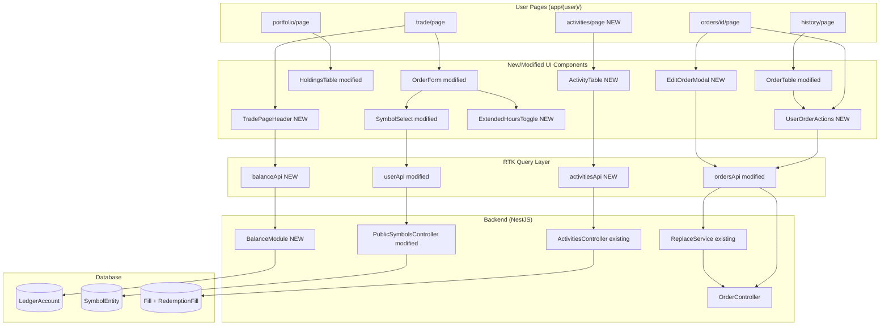
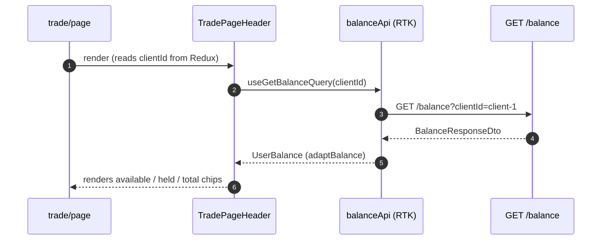
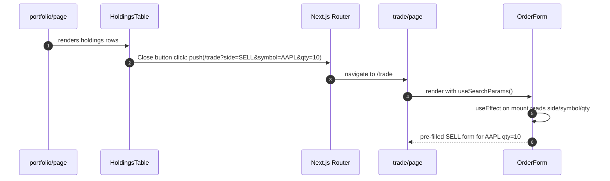
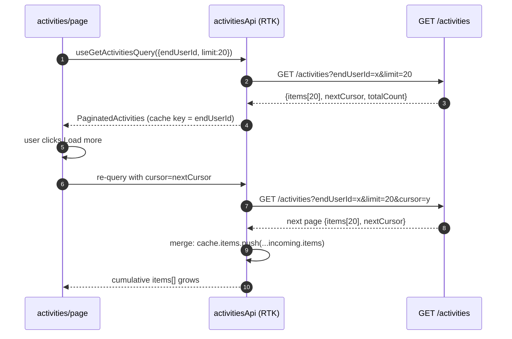

# Alpaca Sign-Off Gaps - High-Level Design

| Attribute | Value |
|-----------|-------|
| **Date** | 2026-08-05 |
| **Status** | Draft |
| **Version** | 1.0 |

---

## Table of Contents

- [Overview](#overview)
- [Impacted Applications](#impacted-applications)
- [Requirements Overview](#requirements-overview)
- [Technical Implementation](#technical-implementation)
- [System Architecture](#system-architecture)
- [Security Considerations](#security-considerations)
- [Risk, Limitations & Out of Scope](#risk-limitations--out-of-scope)
- [Deployment Plan](#deployment-plan)
- [Open Items](#open-items)
- [Assumptions](#assumptions)
- [Revision History](#revision-history)

---

## Overview

This feature closes 7 gaps identified in the Alpaca Institutional Tech Sign-Off checklist. It adds account balance display, enriched asset metadata, cancel/update order capabilities in user mode, close position from the portfolio page, an extended hours toggle, and an account activities history page.

### Background

The Alpaca Tech Sign-Off checklist requires demonstrating specific broker-facing capabilities before go-live. An audit of the sign-off spreadsheet (`Nano - Tech Sign-Off.xlsx`) identified 4 required and 3 optional items not yet implemented in the user-facing dashboard. This HLD covers all 7 items.

### Goals

- Pass all 4 required Alpaca sign-off checklist items (Account Funding display, Asset Retrieval with metadata, Cancel Order for user mode, Close Open Positions)
- Implement 3 optional items: Extended Hours trading, Update Orders, Account Activities view
- Maintain the existing clean codebase patterns (RTK Query, adapters, shadcn/ui)
- Introduce no breaking changes to existing admin flows

### Non-Goals

- Per-end-user ledger balance (balance is at the client pool level)
- Real-time NTA (non-trade activity — fee/dividend events) streaming from Alpaca SSE
- Cancel SELL (redemption) orders — backend `POST /redemptions/:id/cancel` endpoint does not exist; cancel is scoped to BUY orders only
- Corporate Actions (sign-off item #14) — deferred
- Events stream (sign-off item #15) — deferred
- Mobile responsive layout improvements

---

## Impacted Applications

| Application | Impact Type | Description |
|-------------|-------------|-------------|
| `xequity` (NestJS backend) | New Module | New `BalanceModule` with `GET /balance?clientId=` endpoint |
| `xequity` (NestJS backend) | Modified | `GET /symbols` enriched to return `SymbolMetaDto[]` instead of `string[]` |
| `xequity-face` (Next.js frontend) | New Pages | `/activities` route page for account activity history |
| `xequity-face` (Next.js frontend) | New Components | `TradePageHeader`, `ExtendedHoursToggle`, `UserOrderActions`, `EditOrderModal`, `ActivityTable` |
| `xequity-face` (Next.js frontend) | Modified | `OrderForm`, `SymbolSelect`, `HoldingsTable`, `OrderTable`, `Sidebar`, History page, Trade page |

---

## Requirements Overview

### Functional Requirements

| ID | Requirement | Priority |
|----|-------------|----------|
| FR-01 | Display client account balance (available, held, total) on the Trade page header | Must Have |
| FR-02 | Filter `GET /symbols` to return only tradable symbols with fractionable/overnight metadata | Must Have |
| FR-03 | Show Cancel button on eligible order rows in user History page and order detail page | Must Have |
| FR-04 | "Close" button on each Portfolio holding row navigates to Trade page pre-filled with SELL | Must Have |
| FR-05 | Extended Hours checkbox in OrderForm; enabling forces LIMIT order type | Should Have |
| FR-06 | Edit Order modal on user order detail page for resting LIMIT orders (PATCH /orders/:id) | Should Have |
| FR-07 | Account Activities page at `/activities` showing cursor-paginated BUY/SELL fill history | Should Have |
| FR-08 | "Activities" link in user sidebar navigation | Should Have |

### Non-Functional Requirements

| ID | Requirement | Target |
|----|-------------|--------|
| NFR-01 | Balance query latency | < 200ms p99 (single-client DB read) |
| NFR-02 | Symbol metadata query latency | < 100ms p99 (cached query, no joins) |
| NFR-03 | Activities page first load | < 500ms p99 for 20 items |
| NFR-04 | No breaking change to existing admin flows | All existing tests pass |

---

## Technical Implementation

### Overview

The implementation follows a layered approach: backend changes expose new or enriched data; RTK Query adapter files normalize responses; UI components display the data. All 7 gaps share the same pattern:

```
Backend DTO → GET endpoint → adaptX() → RTK Query hook → React component
```

No new database tables or migrations are needed. All required data already exists in the database (`LedgerAccount`, `SymbolEntity`, `Fill`, `RedemptionFill`).

### Key Components

#### BalanceModule (Backend)

- **Purpose:** Expose a per-client balance endpoint that aggregates `CLIENT_AVAILABLE` and `CLIENT_HOLD` ledger accounts
- **Technology:** NestJS module, TypeORM `RepositoryService`
- **Changes Required:** 4 new files (`balance.module.ts`, `balance.controller.ts`, `balance.service.ts`, `dto/balance-response.dto.ts`); register in `app.module.ts`
- **DRY Note:** `AdminLedgerController` contains inline aggregation logic for the same `CLIENT_AVAILABLE`/`CLIENT_HOLD` query. The new `BalanceService.getBalanceForClient(clientId)` must encapsulate this logic as a reusable service method. The admin controller should be refactored (or noted for future refactoring) to delegate to this shared service. Do not duplicate the aggregation inline in the new controller.

#### Symbol Metadata Enrichment (Backend)

- **Purpose:** Return `SymbolMetaDto[]` from `GET /symbols` so the frontend can filter non-tradable symbols and display overnight trading eligibility
- **Technology:** TypeORM field selection on existing `SymbolEntity`
- **Changes Required:** New `SymbolMetaDto`; add `listActiveMeta()` to `SymbolsService`; update `PublicSymbolsController` return type

#### TradePageHeader (Frontend)

- **Purpose:** Display available/held/total client balance above the OrderForm
- **Technology:** RTK Query (`useGetBalanceQuery`), shadcn/ui stat chips
- **Changes Required:** New `balanceApi.ts`, new `TradePageHeader.tsx` component, wire into `trade/page.tsx`

#### SymbolSelect + OrderForm Asset Filtering (Frontend)

- **Purpose:** Only show tradable symbols in the order form dropdown; expose `tradableOvernight` for extended hours warning
- **Technology:** RTK Query `transformResponse`, `SymbolMeta` type
- **Changes Required:** `adaptSymbolMeta()` adapter; `SymbolSelect` accepts `SymbolMeta[]`; `OrderForm` derives `selectedSymbolMeta`

#### UserOrderActions (Frontend)

- **Purpose:** Shared Cancel + Edit actions component for user-context orders, reused on both History list rows and order detail page
- **Technology:** shadcn/ui `AlertDialog` (cancel) + `Dialog` (edit), RTK mutations
- **Changes Required:** New `UserOrderActions.tsx`; `OrderTable` gains optional `actions` column prop
- **Cancel constraint:** Cancel button renders only when `order.side === 'BUY' AND order.state IN ['QUEUED', 'OPEN_EXECUTING', 'PARTIALLY_FILLED']`. No cancel for SELL orders (no `POST /redemptions/:id/cancel` endpoint on backend).
- **Edit constraint:** Edit button renders only when `order.side === 'BUY' AND order.type === 'LIMIT' AND order.state IN ['OPEN_EXECUTING', 'PARTIALLY_FILLED']`. This matches the constraints enforced by backend `ReplaceService`.

#### EditOrderModal (Frontend)

- **Purpose:** Dialog form for replacing a resting LIMIT order via `PATCH /orders/:id`
- **Technology:** shadcn/ui `Dialog`, `useReplaceOrderMutation`
- **Changes Required:** New `EditOrderModal.tsx`; `useReplaceOrderMutation` and `useReplaceRedemptionMutation` added to `ordersApi.ts`

#### ActivityTable + Activities Page (Frontend)

- **Purpose:** Cursor-paginated activity history showing BUY/SELL fills per end-user
- **Technology:** RTK Query cursor pagination (`merge` + `serializeQueryArgs`), shadcn/ui `Table`
- **Changes Required:** New `activitiesApi.ts`, `ActivityTable.tsx`, `app/(user)/activities/page.tsx`; Sidebar updated

### API Changes

#### New Endpoints

| Method | Endpoint | Description |
|--------|----------|-------------|
| GET | `/balance?clientId=<uuid>` | Returns available/held/total balance for a client. No global prefix in `main.ts`; runtime path is `/balance`. |

#### Modified Endpoints

| Method | Endpoint | Before | After |
|--------|----------|--------|-------|
| GET | `/symbols` | Returns `string[]` | Returns `SymbolMetaDto[]` |

> **Deployment atomicity**: The `/symbols` enrichment (backend) and the `adaptSymbolMeta()` adapter update (frontend) **must be deployed in the same release**. The existing `adaptSymbols` reads `item.symbol`, but `SymbolMetaDto` uses `ticker` as the field name. If backend is deployed without the frontend adapter, the symbol dropdown will render empty for all users. Coordinate a single joint deployment or use a backward-compatible query param `?format=meta` while the transition is staged.

#### Request/Response Examples

**GET /balance?clientId=client-1**

Response (200 OK):
```json
{
  "available": "50000.000000",
  "held": "1200.500000",
  "total": "51200.500000"
}
```

**GET /symbols** (enriched)

Response (200 OK):
```json
[
  { "ticker": "AAPL", "tradable": true, "fractionable": true, "tradableOvernight": false },
  { "ticker": "MSFT", "tradable": true, "fractionable": true, "tradableOvernight": false },
  { "ticker": "SPY", "tradable": false, "fractionable": false, "tradableOvernight": false }
]
```

**PATCH /orders/:id** (already implemented in backend)

Request:
```json
{
  "qty": "15",
  "limitPrice": "155.00",
  "tif": "GTC"
}
```

Response: `204 No Content`

Constraints enforced by `ReplaceService`:
- `order.side` must be `BUY` (SELL-side replace not supported — escrow resize required)
- `order.state` must be `OPEN_EXECUTING` or `PARTIALLY_FILLED`
- `order.type` must be `LIMIT`

The frontend `useReplaceOrderMutation` should not define `transformResponse`; check success via `isSuccess` on the mutation result.

**GET /activities?endUserId=user-001&limit=20**

Response (200 OK):
```json
{
  "items": [
    {
      "id": "fill-uuid",
      "type": "BUY",
      "symbol": "AAPL",
      "qty": "10.000000",
      "amount": "1500.000000",
      "price": "150.000000",
      "state": "COMPLETED",
      "alpacaFillId": "alpaca-fill-id",
      "referenceId": "order-uuid",
      "createdAt": "2026-08-05T10:30:00.000Z"
    }
  ],
  "nextCursor": "eyJjcmVhdGVkQXQiOiIyMDI2LTA4LTA1VDEwOjMwOjAwLjAwMFoiLCJpZCI6ImZpbGwtdXVpZCJ9",
  "totalCount": 42
}
```

### Database Changes

No new tables or migrations required. All queries use existing entities:

- `LedgerAccount` — `BalanceService` queries `accountType IN ('CLIENT_AVAILABLE', 'CLIENT_HOLD')` filtered by `scopeClientId`
- `SymbolEntity` — `listActiveMeta()` selects 4 existing columns: `ticker`, `tradable`, `fractionable`, `tradableOvernight`
- `Fill` and `RedemptionFill` — already queried by `ActivitiesService`

---

## System Architecture

### Architecture Diagram



### Sequence Diagram — Balance Widget Load



**Step Explanation:**
1. Trade page renders `TradePageHeader` alongside `OrderForm`
2. `TradePageHeader` reads `clientId` from Redux `selectSelectedEndUser`
3. RTK Query calls `GET /balance?clientId=client-1`
4. `BalanceService` aggregates CLIENT_AVAILABLE + CLIENT_HOLD ledger accounts
5. `adaptBalance()` coerces decimal strings to numbers
6. Three stat chips render with formatted currency values

### Sequence Diagram — Close Position Flow



**Step Explanation:**
1. Portfolio page renders HoldingsTable with each holding row
2. User clicks "Close" on the AAPL row
3. `useRouter().push()` navigates to `/trade` with query params
4. Trade page renders with `?side=SELL&symbol=AAPL&qty=10` in URL
5. `OrderForm.useEffect` runs once on mount and reads the params
6. Form is pre-filled with SELL side, AAPL symbol, and quantity 10

### Sequence Diagram — Activities Cursor Pagination



**Step Explanation:**
1-4: Initial 20-item load; cache key is `endUserId`
5-9: "Load more" click sets cursor and re-queries
10: RTK `merge` callback appends new items without clearing existing rows

---

## Security Considerations

### GET /balance Endpoint Authentication

The new `GET /balance?clientId=<uuid>` endpoint returns financial data (available balance, held funds, total). It must not be unauthenticated.

**For M1 (sandbox sign-off):** Apply `@IsUUID()` validation on the `clientId` query param via `ParseUUIDPipe`. Rely on the existing application-level auth guard already active globally in the NestJS app.

**For production:** The `clientId` must be derived from the authenticated JWT subject, not accepted as a query param. Implementation path:
1. Ensure the JWT token issued during login carries the `clientId` claim.
2. `BalanceController` reads `clientId` from `req.user.clientId` (injected by `JwtAuthGuard`).
3. Drop the `clientId` query param entirely — any attempt to spoof it is rejected server-side.
4. Add an ownership check: the authenticated end-user's `clientId` must match the balance being requested.

This is tracked as OI-01 in the Open Items table.

### Input Validation

- `GET /balance?clientId=`: `ParseUUIDPipe` rejects malformed UUIDs with HTTP 400
- `PATCH /orders/:id`: `ReplaceOrderDto` uses `class-validator` decorators; `id` validated via `ParseUUIDPipe`
- `GET /activities?endUserId=`: `ListActivitiesQueryDto` applies `@IsUUID()` on `endUserId`

### OWASP A01 — Broken Access Control

The current `GET /balance` design (M1) relies on knowing the `clientId` UUID. UUIDs are non-guessable but not secret. Do not log `clientId` values in plaintext. The production design (JWT-derived `clientId`) eliminates this risk entirely.

---

## Risk, Limitations & Out of Scope

### Out of Scope (Current Design)

| Item | Reason | Future Consideration |
|------|--------|---------------------|
| Per-end-user balance | Ledger accounts are CLIENT-scoped only; no end-user level balance exists in schema | Schema extension in a future billing redesign |
| NTA (non-trade activity) streaming | Alpaca SSE stream only active in `ALPACA_MODE=live`; sandbox environment does not emit NTA events | Phase 2 when moving to live mode |
| Corporate Actions (#14) | Alpaca sandbox does not generate CA events | Post go-live |
| Events stream (#15) | Requires live Alpaca account | Post go-live |
| Redemption replace (`PATCH /redemptions/:id`) UI | `ReplaceRedemptionDto` exists in backend but user-facing sell-order editing is a rare workflow | Can be added when needed |

### Design Limitations

| Limitation | Impact | Workaround | Future Improvement |
|------------|--------|------------|-------------------|
| Balance is client-pool level, not per-user | Users of the same client share one balance display | Display labels it as "Pool Balance" | Add per-user balance tracking when needed |
| `GET /symbols` enrichment breaks `string[]` contract | Any admin code consuming `GET /symbols` as `string[]` will need updates | Update `adaptSymbols` in admin flows to use new shape | N/A — the new shape is strictly richer |
| Extended hours overnight flag is informational only | Frontend shows a warning when `tradableOvernight=false` but does not block submission | User sees the warning; backend/Alpaca will reject if ineligible | Consider blocking the toggle for non-overnight symbols |

### Known Risks

| ID | Risk | Probability | Impact | Mitigation | Status |
|----|------|-------------|--------|------------|--------|
| R-01 | `GET /symbols` enrichment breaks symbol dropdown if backend and frontend are deployed separately | High | High | Coordinate joint deployment of backend `SymbolMetaDto` change + frontend `adaptSymbolMeta` adapter. `SymbolMetaDto` uses `ticker` field; existing `adaptSymbols` reads `item.symbol` — mismatch returns empty array. | Open |
| R-02 | `GET /balance` endpoint `clientId` from query param (M1) — any authenticated user can request any client's balance | Low | Medium | M1: `ParseUUIDPipe` + app-level auth guard. Production: derive `clientId` from JWT, remove query param. See Security Considerations. | Open |
| R-03 | RTK cursor merge accumulates stale data if user changes | Low | Low | `serializeQueryArgs` keys on `endUserId` — switching users resets the cache | Mitigated |
| R-04 | `UserOrderActions` Edit/Cancel shown to SELL orders at runtime | Low | Low | Explicit gate: `side === 'BUY'` required for both Cancel and Edit. No backend SELL-cancel endpoint exists. | Mitigated |

---

## Deployment Plan

### Prerequisites

- [ ] Backend `BalanceModule` deployed and smoke-tested at `GET /balance?clientId=<test-uuid>`
- [ ] `GET /symbols` returning `SymbolMetaDto[]` verified (no regression on existing frontend symbol loading)
- [ ] All 14 new/modified frontend files code-reviewed
- [ ] Vitest test suite passing (target: 0 new failures)

### Deployment Phases

| Phase | Description | Rollback Point |
|-------|-------------|----------------|
| 1 | Deploy backend changes (BalanceModule + symbols enrichment) | Yes — revert `app.module.ts` registration |
| 2 | Deploy frontend API layer (adapters, RTK slices) | Yes — revert to previous `userApi.ts` symbols shape |
| 3 | Deploy UI components and pages | Yes — feature behind user-mode auth |

---

## Open Items

| ID | Item | Owner | Due Date | Status |
|----|------|-------|----------|--------|
| OI-01 | Confirm `GET /balance` endpoint auth strategy for production (JWT vs query param) | Backend team | Before go-live | Open |
| OI-02 | Verify `tradableOvernight` column is populated correctly by `AssetSyncJob` for all symbols | Backend team | Before testing | Open |
| OI-03 | Confirm whether `PATCH /redemptions/:id` (sell-side replace) needs to be surfaced in UI | Product | TBD | Open |

---

## Assumptions

| ID | Assumption | Impact if Invalid |
|----|------------|-------------------|
| A-01 | `LedgerAccount.scopeClientId` correctly identifies the client pool for the selected end-user | Balance widget would show wrong or no balance |
| A-02 | `SymbolEntity.tradable` column is `true` for all Alpaca-tradable symbols and `false` for suspended/delisted ones | Symbol dropdown would show non-tradable symbols or hide tradable ones |
| A-03 | `PATCH /orders/:id` (ReplaceService) supports `qty`, `limitPrice`, `tif` for BUY LIMIT orders in `OPEN_EXECUTING` or `PARTIALLY_FILLED` state — confirmed by reading `replace.service.ts` | EditOrderModal would submit incorrect payloads |
| A-04 | `app/(user)/orders/[id]/page.tsx` does not currently exist — verified. This page must be created as part of this feature (see TASK-009). The admin page at `app/(admin)/orders/[id]/page.tsx` is separate and admin-gated. | Edit/Cancel on order detail is blocked until this page is created |

---

## Revision History

| Version | Date | Changes |
|---------|------|---------|
| 1.0 | 2026-08-05 | Initial draft |
| 1.1 | 2026-08-05 | Architecture review fixes: added Security Considerations section; corrected PATCH response 200→204; explicit BUY-only constraints for Cancel/Edit; atomic deployment note for symbols enrichment; SymbolMetaDto field name (`ticker`) documented; BalanceModule DRY note; updated risks R-01/R-02/R-04; A-04 confirmed as verified finding; user order detail page added as TASK-009 |
