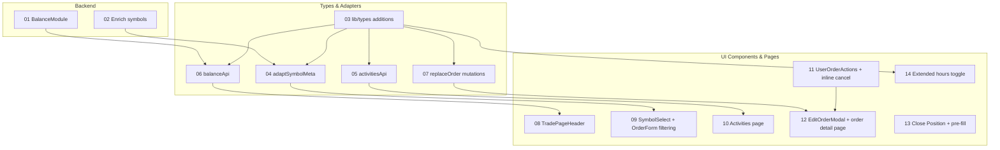

# Task Breakdown: Alpaca Sign-Off Gaps

| Attribute | Value |
|-----------|-------|
| **HLD Reference** | [HLD-alpaca-signoff-gaps.md](../HLD-alpaca-signoff-gaps.md) |
| **Created** | 2026-08-05 |
| **Status** | Draft |
| **Version** | 1.0 |

## Task Summary

| ID | Task | Domain | Dependencies | Status |
|----|------|--------|--------------|--------|
| 01 | Backend: BalanceModule + GET /balance endpoint | Backend | — | completed |
| 02 | Backend: Enrich GET /symbols to return SymbolMetaDto | Backend | — | completed |
| 03 | Frontend: lib/types additions (balance, activity, SymbolMeta, extendedHours) | Frontend/Types | — | completed |
| 04 | Frontend: adaptSymbolMeta adapter + update userApi | Frontend/API | 03 | completed |
| 05 | Frontend: activitiesApi.ts + Activity types | Frontend/API | 03 | completed |
| 06 | Frontend: balanceApi.ts + adaptBalance adapter | Frontend/API | 01, 03 | completed |
| 07 | Frontend: replaceOrder + replaceRedemption RTK mutations | Frontend/API | 03 | completed |
| 08 | Frontend: TradePageHeader balance widget | Frontend/UI | 06 | completed |
| 09 | Frontend: SymbolSelect + OrderForm asset filtering | Frontend/UI | 04 | completed |
| 10 | Frontend: Activities page + ActivityTable + Sidebar link | Frontend/UI | 05 | completed |
| 11 | Frontend: UserOrderActions + History page inline cancel | Frontend/UI | — | completed |
| 12 | Frontend: EditOrderModal + user order detail page | Frontend/UI | 07, 11 | completed |
| 13 | Frontend: Close Position button in HoldingsTable + OrderForm pre-fill | Frontend/UI | — | completed |
| 14 | Frontend: Extended hours toggle in OrderForm | Frontend/UI | 03 | completed |

## Dependency Graph

## Task Files

- [task-01-balance-module.md](./task-01-balance-module.md)
- [task-02-enrich-symbols.md](./task-02-enrich-symbols.md)
- [task-03-types-additions.md](./task-03-types-additions.md)
- [task-04-adapt-symbol-meta.md](./task-04-adapt-symbol-meta.md)
- [task-05-activities-api.md](./task-05-activities-api.md)
- [task-06-balance-api.md](./task-06-balance-api.md)
- [task-07-replace-mutations.md](./task-07-replace-mutations.md)
- [task-08-trade-page-header.md](./task-08-trade-page-header.md)
- [task-09-symbol-select-filtering.md](./task-09-symbol-select-filtering.md)
- [task-10-activities-page.md](./task-10-activities-page.md)
- [task-11-user-order-actions.md](./task-11-user-order-actions.md)
- [task-12-edit-order-modal.md](./task-12-edit-order-modal.md)
- [task-13-close-position.md](./task-13-close-position.md)
- [task-14-extended-hours.md](./task-14-extended-hours.md)

---

## Implementation Report

> Filled after implementation by `/nb-feature-impl`

### Summary

_To be filled_

### Files Changed

| File | Action | Purpose |
|------|--------|---------|
| _To be filled_ | | |

### Tests Added

| Test | Coverage |
|------|----------|
| _To be filled_ | |

### Code Review Findings

_To be filled_

### Verification

- [ ] All tests passing
- [ ] Code compiles without TypeScript errors
- [ ] Matches architecture specification

---

## Revision History

| Date | Version | Changes |
|------|---------|---------|
| 2026-08-05 | 1.0 | Initial task breakdown |
