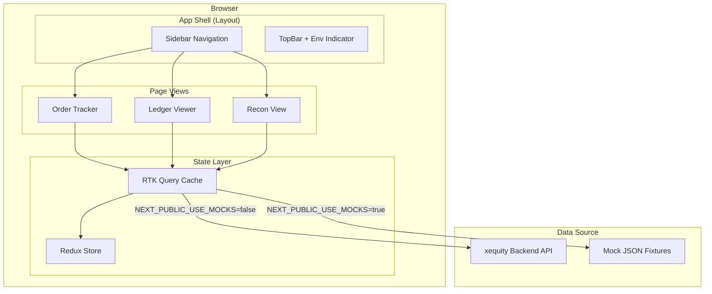

# HLD — Developer Debug Dashboard (xequity-face)

| | |
|---|---|
| **Feature** | Developer Debug Dashboard |
| **Application** | xequity-face (Next.js 16, App Router) |
| **Author** | Architecture |
| **Status** | Draft |
| **Date** | 2026-08-03 |

### Revision History

| Version | Date | Changes |
|---------|------|---------|
| 1.0 | 2026-08-03 | Initial HLD — architecture, component hierarchy, data flow, mock strategy |

---

## 1. Overview

### 1.1 Background

The xequity platform needs an internal developer debug dashboard for the small dev/ops team to track orders, monitor ledger balances, and verify reconciliation status. This is **not** a production admin portal (that comes later) — it is a lightweight internal tool optimized for debugging and money tracking during development.

The backend (xequity) exposes REST APIs, some of which exist today and some of which are yet to be built. The frontend must work with mock data until all backend endpoints are available.

### 1.2 Goals

1. Provide a single pane of glass for **order lifecycle tracking** (buys and redemptions) with drill-down to fills, mint/burn status, and ledger impact
2. Expose **ledger balances and transaction history** across all clients for debugging money flow
3. Show **reconciliation status** (cash and supply) with visual break indicators
4. Work entirely with mock data when backend APIs are unavailable (`NEXT_PUBLIC_USE_MOCKS=true`)
5. Ship fast — minimal polish, maximum utility for a small dev team

### 1.3 Non-Goals

- Authentication / RBAC (deferred)
- Mobile responsiveness
- End-user or client management screens
- CSV/JSON export
- Symbol management / kill switches
- Deposit / withdrawal tracker
- Audit log viewer

---

## 2. Architecture Overview

### 2.1 Tech Stack

| Layer | Technology | Version |
|-------|-----------|---------|
| Framework | Next.js (App Router) | 16.x |
| Language | TypeScript | 5.x |
| Styling | Tailwind CSS | 4.x |
| Component library | shadcn/ui | latest |
| State management | Redux Toolkit + RTK Query | latest |
| Tables | TanStack Table | v8 |
| Testing | Vitest + React Testing Library | latest |

### 2.2 Architecture Diagram



### 2.3 Data Flow

1. Pages render components that consume data via RTK Query hooks (`useGetOrdersQuery`, `useGetBalancesQuery`, etc.)
2. RTK Query manages caching, polling, and deduplication automatically
3. The **base query** function checks `NEXT_PUBLIC_USE_MOCKS` — if `true`, it intercepts the request and returns data from local JSON fixtures; if `false`, it makes a real `fetch` to `NEXT_PUBLIC_API_URL`
4. Polling intervals are set per endpoint: orders 5s, ledger 10s, recon 30s
5. Mutation endpoints (retry mint, retry burn, cancel order) always hit the real API (no mock mutations)

---

## 3. File & Folder Structure

```
app/
  layout.tsx                    # Root layout: sidebar, topbar, Redux provider
  page.tsx                      # Redirect to /orders
  orders/
    page.tsx                    # Order tracker list view
    [id]/
      page.tsx                  # Order detail drill-down
  ledger/
    page.tsx                    # Ledger viewer (balances + transactions)
  recon/
    page.tsx                    # Reconciliation view

components/
  layout/
    Sidebar.tsx                 # Left nav: Orders, Ledger, Recon
    TopBar.tsx                  # App name + environment indicator
  orders/
    OrderTable.tsx              # Combined orders + redemptions table (TanStack)
    OrderFilters.tsx            # Filter bar: client, end-user, symbol, status, date
    OrderDetail.tsx             # Full order detail panel
    FillsTable.tsx              # Fills sub-table within detail
    StateTimeline.tsx           # Visual state transition timeline
    ActionButtons.tsx           # Retry mint, retry burn, cancel (with confirm)
  ledger/
    BalanceSummary.tsx          # All-clients balance table with totals row
    TransactionLog.tsx          # Transaction list with pagination
    TransactionFilters.tsx      # Filter bar: client, type, date range
  recon/
    CashRecon.tsx               # Cash reconciliation summary card
    SupplyRecon.tsx             # Per-symbol supply recon table
  ui/                           # shadcn/ui components (installed via CLI)

lib/
  store/
    store.ts                    # Redux store configuration
    hooks.ts                    # Typed useAppDispatch, useAppSelector
  api/
    baseApi.ts                  # RTK Query createApi with mock-aware baseQuery
    ordersApi.ts                # Order + redemption endpoints (queries + mutations)
    ledgerApi.ts                # Balance + transaction endpoints
    reconApi.ts                 # Cash recon + supply recon endpoints
  mocks/
    orders.json                 # Mock: order list, order detail, fills
    ledger.json                 # Mock: balances, transactions
    recon.json                  # Mock: cash recon, supply recon
    mockBaseQuery.ts            # Mock base query interceptor logic
  types/
    order.ts                    # Order, Redemption, Fill, OrderState types
    ledger.ts                   # Balance, Transaction, TransactionType types
    recon.ts                    # CashRecon, SupplyRecon types
  utils/
    env.ts                      # Environment helpers (getApiUrl, isMockMode, getEnvLabel)
    formatters.ts               # Currency, date, number formatting helpers
```

---

## 4. State Management

### 4.1 Redux Store Structure

The store is intentionally thin. RTK Query manages all server state (caching, polling, invalidation). No custom slices are needed for v1 — component-local state handles UI concerns (filters, selected rows, dialog open state).

```typescript
// lib/store/store.ts
import { configureStore } from '@reduxjs/toolkit';
import { baseApi } from '@/lib/api/baseApi';

export const store = configureStore({
  reducer: {
    [baseApi.reducerPath]: baseApi.reducer,
  },
  middleware: (getDefaultMiddleware) =>
    getDefaultMiddleware().concat(baseApi.middleware),
});
```

### 4.2 RTK Query API Design

A single `baseApi` with `createApi` — all domain-specific endpoints injected via `injectEndpoints`:

| API Slice | Endpoints | Polling |
|-----------|-----------|---------|
| `ordersApi` | `getOrders`, `getOrder`, `getOrderFills`, `getRedemptions`, `getRedemption`, `getRedemptionFills`, `retryMint`, `retryBurn`, `cancelOrder` | 5s (list) |
| `ledgerApi` | `getBalances`, `getTransactions` | 10s (balances), none (transactions — paginated) |
| `reconApi` | `getCashRecon`, `getSupplyRecon`, `runCashRecon` | 30s |

### 4.3 Mock-Aware Base Query

```typescript
// lib/api/baseApi.ts — conceptual
import { createApi, fetchBaseQuery } from '@reduxjs/toolkit/query/react';
import { isMockMode, getApiUrl } from '@/lib/utils/env';
import { mockBaseQuery } from '@/lib/mocks/mockBaseQuery';

const realBaseQuery = fetchBaseQuery({ baseUrl: getApiUrl() });

const baseQueryWithMocks: BaseQueryFn = async (args, api, extraOptions) => {
  if (isMockMode()) {
    return mockBaseQuery(args);
  }
  return realBaseQuery(args, api, extraOptions);
};

export const baseApi = createApi({
  reducerPath: 'api',
  baseQuery: baseQueryWithMocks,
  tagTypes: ['Orders', 'Balances', 'Transactions', 'Recon'],
  endpoints: () => ({}),
});
```

The `mockBaseQuery` function matches the URL pattern of incoming requests against a registry of mock handlers and returns the corresponding JSON fixture data. This keeps mock logic centralized and easy to remove later.

---

## 5. Component Design

### 5.1 Layout Components

**Sidebar** — fixed left sidebar with three navigation links (Orders, Ledger, Recon). Uses Next.js `usePathname()` for active-link highlighting. Collapsed on narrow viewports (optional).

**TopBar** — horizontal bar across the top. Displays "xequity-face" on the left, environment label on the right (derived from `NEXT_PUBLIC_API_URL` — shows "localhost:3000" or "staging" etc.). Environment label uses a colored badge (green for local, yellow for staging).

### 5.2 Order Tracker Components

**OrderTable** — TanStack Table rendering combined orders and redemptions. Columns: ID, side (BUY/SELL), symbol, end-user, client, type, qty, notional, limit price, state, created, updated. Server-side pagination via cursor/offset. Row click navigates to `/orders/[id]`.

**OrderFilters** — filter controls above the table: client dropdown, end-user text input, symbol dropdown, status multi-select, date range picker. Filters are passed as query parameters to the RTK Query endpoint. Filters are managed as component-local state and serialized to URL search params for shareability.

**OrderDetail** — full detail view at `/orders/[id]`. Fetches single order + fills. Renders:
- Order header (all fields)
- StateTimeline component
- FillsTable component
- Mint/burn status per fill
- Ledger impact summary
- For redemptions: partition breakdown (lockedQty, burnedQty, releasedQty)

**StateTimeline** — vertical timeline showing state transitions with timestamps. Each node shows `state` and `transitionedAt`. Uses simple Tailwind-styled divs (no charting library needed).

**FillsTable** — sub-table within detail: fill ID, qty, price, cost, timestamp. Simple TanStack Table.

**ActionButtons** — conditional action buttons:
- "Retry Mint" — shown when order state is `MINT_FAILED`
- "Retry Burn" — shown when redemption state is `BURN_FAILED`
- "Cancel Order" — shown when state is `OPEN_EXECUTING`, `QUEUED`, or `PARTIALLY_FILLED`
- Each triggers a confirmation dialog (shadcn AlertDialog) before calling the mutation endpoint

### 5.3 Ledger Viewer Components

**BalanceSummary** — table of all clients: client name, available USDT, held USDT, total USDT. A bold "Global Totals" row at the top sums all values. Polls every 10s.

**TransactionLog** — paginated table of transactions: timestamp, client, end-user, type, amount, running balance, reference ID, description. Server-side pagination. Clicking a reference ID navigates to the related order in the Order Tracker.

**TransactionFilters** — filter bar: client dropdown, transaction type multi-select, date range picker.

### 5.4 Reconciliation View Components

**CashRecon** — card showing: USDT ledger total, USDT wallet balance, delta (with green/red indicator), USD float at Alpaca, projected float requirement, last recon timestamp. "Run recon now" button triggers `POST /admin/recon/cash`. Polls every 30s.

**SupplyRecon** — table per symbol: symbol, on-chain supply, Alpaca position sum, residual, status. Each row has a green/red indicator based on residual (green = 0, red = non-zero). Polls every 30s.

---

## 6. Data Types

### 6.1 Order Types

```typescript
// lib/types/order.ts

type OrderSide = 'BUY' | 'SELL';
type OrderType = 'MARKET' | 'LIMIT';
type OrderState =
  | 'SUBMITTED' | 'VALIDATED' | 'QUEUED'
  | 'OPEN_EXECUTING' | 'FILLED' | 'PARTIALLY_FILLED'
  | 'MINTING' | 'SETTLED'
  | 'REJECTED' | 'CANCELLED' | 'EXPIRED'
  | 'MINT_FAILED' | 'BURN_FAILED';

interface Order {
  id: string;
  side: OrderSide;
  symbol: string;
  endUserId: string;
  clientId: string;
  clientName: string;
  type: OrderType;
  qty: number;
  notional: number | null;
  limitPrice: number | null;
  state: OrderState;
  clientIdemKey: string;
  alpacaOrderId: string | null;
  pinnedSpreadBps: number;
  walletId: string;
  createdAt: string;
  updatedAt: string;
  stateTransitions: StateTransition[];
  // Redemption-specific fields (present when side === 'SELL')
  lockedQty?: number;
  burnedQty?: number;
  releasedQty?: number;
}

interface StateTransition {
  fromState: OrderState | null;
  toState: OrderState;
  transitionedAt: string;
}

interface Fill {
  fillId: string;
  qty: number;
  price: number;
  cost: number;
  filledAt: string;
  mintTxHash?: string;
  burnTxHash?: string;
  onChainStatus?: 'PENDING' | 'CONFIRMED' | 'FAILED';
  retryCount?: number;
}
```

### 6.2 Ledger Types

```typescript
// lib/types/ledger.ts

interface ClientBalance {
  clientId: string;
  clientName: string;
  available: number;
  held: number;
  total: number;
}

type TransactionType =
  | 'DEPOSIT' | 'WITHDRAWAL'
  | 'BUY_HOLD' | 'BUY_HOLD_RELEASE' | 'BUY_DEBIT'
  | 'SELL_CREDIT' | 'DIVIDEND_CREDIT'
  | 'SPREAD_REVENUE' | 'CONVERSION';

interface Transaction {
  id: string;
  timestamp: string;
  clientId: string;
  clientName: string;
  endUserId: string | null;
  type: TransactionType;
  amount: number;
  runningBalance: number;
  referenceId: string | null;
  description: string;
}
```

### 6.3 Reconciliation Types

```typescript
// lib/types/recon.ts

interface CashRecon {
  usdtLedgerTotal: number;
  usdtWalletBalance: number;
  usdtDelta: number;
  usdFloatAtAlpaca: number;
  projectedFloatRequirement: number;
  lastRunAt: string;
}

interface SupplyRecon {
  symbol: string;
  onChainSupply: number;
  alpacaPositionSum: number;
  residual: number;
  symbolStatus: 'ACTIVE' | 'MINT_HALTED' | 'REDEEM_HALTED' | 'HALTED' | 'DELISTING' | 'RETIRED';
}
```

---

## 7. Routing

| Route | Page | Description |
|-------|------|-------------|
| `/` | `app/page.tsx` | Redirect to `/orders` |
| `/orders` | `app/orders/page.tsx` | Order tracker list |
| `/orders/[id]` | `app/orders/[id]/page.tsx` | Order detail drill-down |
| `/ledger` | `app/ledger/page.tsx` | Ledger viewer |
| `/recon` | `app/recon/page.tsx` | Reconciliation view |

---

## 8. Environment Configuration

| Variable | Purpose | Example |
|----------|---------|---------|
| `NEXT_PUBLIC_API_URL` | Backend API base URL | `http://localhost:3000` |
| `NEXT_PUBLIC_USE_MOCKS` | Enable mock data mode | `true` / `false` |

The `env.ts` utility module provides:
- `getApiUrl()` — returns `NEXT_PUBLIC_API_URL`, defaults to `http://localhost:3000`
- `isMockMode()` — returns `true` if `NEXT_PUBLIC_USE_MOCKS === 'true'`
- `getEnvLabel()` — extracts a human-readable label from the API URL (e.g., "localhost:3000", "staging")

---

## 9. Mock Data Strategy

### 9.1 Approach

Mock data lives in `lib/mocks/` as static JSON files. A `mockBaseQuery` function maps URL patterns to the appropriate mock data. This approach:
- Requires no mock server or service worker
- Works seamlessly with RTK Query's caching and polling
- Is trivially removable once all backend APIs ship
- Allows the full UI to be developed and tested without any backend dependency

### 9.2 Mock Data Coverage

| Mock File | Covers | Realistic Scenarios Included |
|-----------|--------|------------------------------|
| `orders.json` | Order list, order detail, fills | Multiple clients, various states including `MINT_FAILED` and `BURN_FAILED`, partial fills, completed orders |
| `ledger.json` | Client balances, transaction log | 3+ clients with varying balances, all transaction types represented, held amounts |
| `recon.json` | Cash recon, supply recon | A case with zero delta (balanced) and a case with non-zero delta for testing red indicators |

### 9.3 Mock Base Query

The `mockBaseQuery` uses a simple URL-pattern registry:

```typescript
// Conceptual — lib/mocks/mockBaseQuery.ts
const mockRoutes: Record<string, (args: any) => unknown> = {
  '/orders': () => mockOrderList,
  '/orders/:id': (args) => mockOrderDetail[args.id],
  '/orders/:id/fills': (args) => mockFills[args.id],
  '/redemptions': () => mockRedemptionList,
  '/admin/ledger/balances': () => mockBalances,
  '/admin/ledger/transactions': () => mockTransactions,
  '/admin/recon/cash/detail': () => mockCashRecon,
  '/admin/recon/supply': () => mockSupplyRecon,
};
```

Mutations (retry, cancel, run recon) in mock mode return a success response with updated mock state but do not persist changes.

---

## 10. Polling Strategy

| Data | Interval | Rationale |
|------|----------|-----------|
| Order list | 5s | Orders move through states quickly during execution |
| Order detail | 5s | Active orders need near-real-time state visibility |
| Balances | 10s | Balances change on fills/deposits — moderate frequency |
| Transactions | None | Paginated, user-triggered — polling would disrupt scroll position |
| Cash recon | 30s | Recon runs every 15 min on backend; 30s is sufficient to catch updates |
| Supply recon | 30s | Same as cash recon |

Polling is configured via RTK Query's `pollingInterval` option on the hook call:

```typescript
const { data } = useGetOrdersQuery(filters, { pollingInterval: 5000 });
```

---

## 11. Testing Strategy

| Layer | Tool | Scope |
|-------|------|-------|
| Component rendering | Vitest + React Testing Library | Components render correctly, display data, handle empty/loading/error states |
| User interaction | React Testing Library + user-event | Filters apply, navigation works, action buttons trigger confirmation dialogs |
| RTK Query mocking | MSW or manual mock of `fetchBaseQuery` | API hooks return expected data, polling works |
| Type safety | TypeScript strict mode | Compile-time checks on all data types |

Unit tests focus on:
1. Each component renders with mock props
2. Filter components update state correctly
3. Action buttons show/hide based on order state
4. Confirmation dialogs prevent unintended mutations
5. Formatters produce correct output (currency, dates)

---

## 12. Risk, Limitations & Out of Scope

### 12.1 Risks

| Risk | Probability | Impact | Mitigation |
|------|-------------|--------|------------|
| Backend API response shapes differ from mock data types | Medium | Medium | Define TypeScript types upfront in `lib/types/`; update when backend ships |
| Polling at 5s causes browser performance issues with large order lists | Low | Medium | Pagination limits result set; can increase interval if needed |
| shadcn/ui components conflict with existing Tailwind config | Low | Low | shadcn/ui is Tailwind-native; conflicts unlikely |

### 12.2 Limitations

- No real-time push (WebSocket/SSE) — polling only, acceptable for a dev tool
- No offline support
- No persistence of filter state across page reloads (URL params partially address this)

### 12.3 Out of Scope

- All items listed in Section 1.3 (Non-Goals)
- Backend API development — this HLD covers the frontend only
- Production deployment pipeline

---

## 13. Deployment Plan

This is an internal dev tool. Deployment is straightforward:

1. Run locally via `npm run dev` during development
2. Optional: deploy to Vercel or a simple Docker container for shared staging access
3. Environment variables set per deployment target via `.env.local` / `.env.staging`

No CI/CD pipeline required for v1, though `npm run lint` and `npm run test` should pass before merges.
