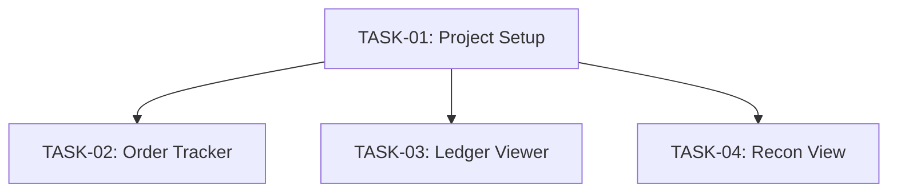

# Task Overview — Developer Debug Dashboard

| | |
|---|---|
| **Feature** | Developer Debug Dashboard |
| **HLD** | [HLD-developer-dashboard.md](../HLD-developer-dashboard.md) |
| **Date** | 2026-08-03 |

---

## Task Summary

| ID | Title | Domain | Size | Status | Dependencies |
|----|-------|--------|------|--------|-------------|
| TASK-01 | Project Setup & Foundation | Infrastructure | M | Complete | None |
| TASK-02 | Order Management View (Client POV) | Feature | L | Complete | TASK-01 |
| TASK-03 | Ledger Viewer | Feature | L | Complete | TASK-01 |
| TASK-04 | Reconciliation View | Feature | M | Complete | TASK-01 |

---

## Dependency Graph

Tasks 02, 03, and 04 are independent of each other and can be developed in parallel once Task 01 is complete.

---

## Size Guide

| Size | Estimated Effort |
|------|-----------------|
| S | 0.5-1 day |
| M | 1-2 days |
| L | 2-4 days |

---

## Implementation Order

1. **TASK-01** — Foundation: dependencies, store, layout, mocks infrastructure
2. **TASK-02** — Order Tracker (highest priority per requirements — P0, most complex view)
3. **TASK-03** — Ledger Viewer (P0, second priority)
4. **TASK-04** — Reconciliation View (P0, least complex of the three)

Tasks 02-04 can be parallelized across developers if the team has capacity.
