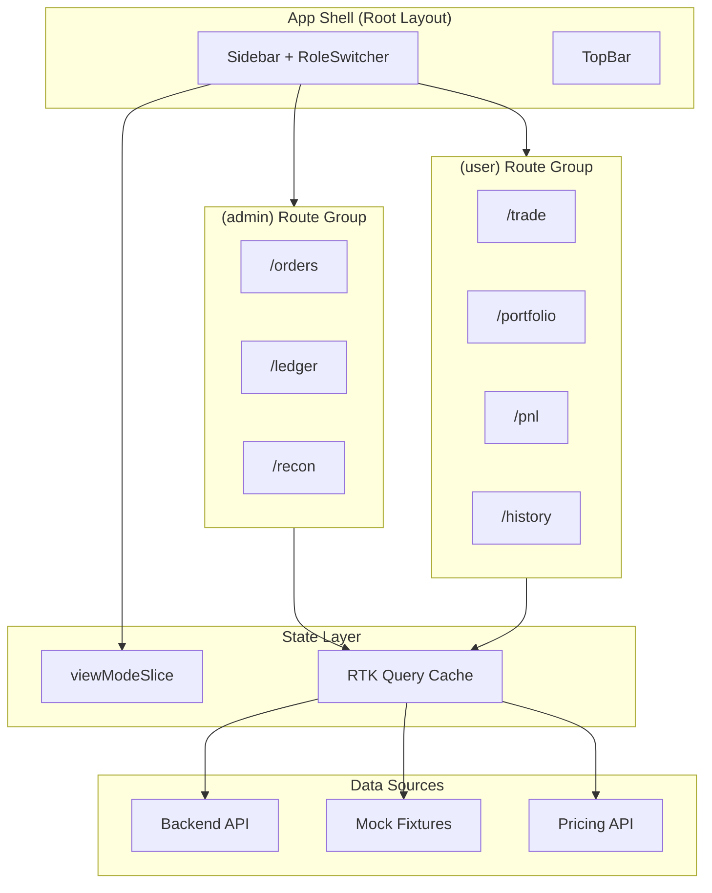
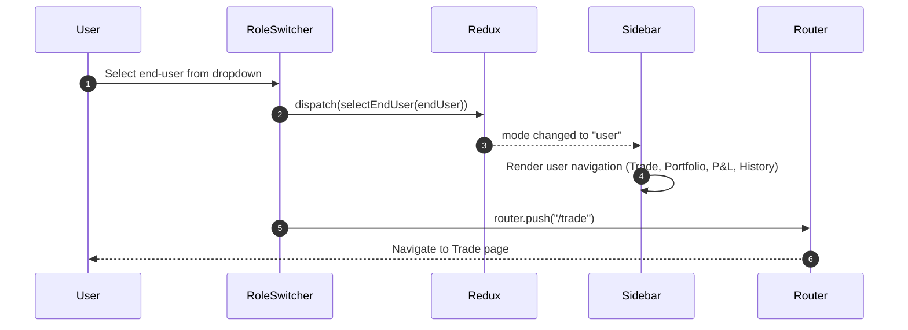
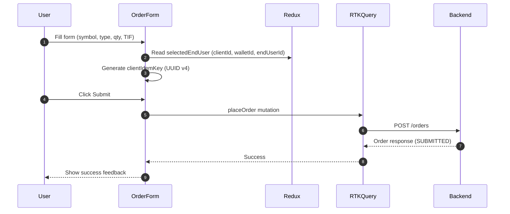
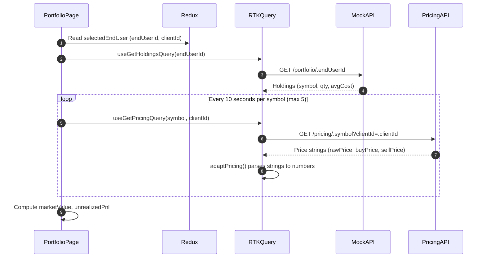

# User Dashboard - High-Level Design

| Attribute | Value |
|-----------|-------|
| **Date** | 2026-08-04 |
| **Status** | In Review |
| **Version** | 1.1 |

---

## Table of Contents

- [Overview](#overview)
- [Impacted Applications](#impacted-applications)
- [Requirements Overview](#requirements-overview)
- [Technical Implementation](#technical-implementation)
- [System Architecture](#system-architecture)
- [Risk, Limitations & Out of Scope](#risk-limitations--out-of-scope)
- [Testing Strategy](#testing-strategy)
- [Deployment Plan](#deployment-plan)
- [Open Items](#open-items)
- [Assumptions](#assumptions)
- [Revision History](#revision-history)

---

## Overview

Add an end-user-facing dashboard to xequity-face alongside the existing admin dashboard. Users can buy/sell stocks, view their portfolio with live pricing, see P&L (realized + unrealized), and review order history. The two dashboards share the same application shell and are switchable via a role-switcher dropdown in the sidebar.

### Background

The xequity-face application currently serves as an admin debug console with three pages: Orders, Ledger, and Recon. There is no user-facing view for end-users to interact with the trading system. Adding a user dashboard enables testing and demonstrating the end-user experience without building a separate application.

### Goals

- Enable simulated end-user trading (buy/sell) through the existing backend API
- Provide portfolio visibility with live pricing via the pricing API
- Show P&L breakdown (realized + unrealized) using mock data
- Allow switching between admin and user contexts via a sidebar dropdown
- Follow existing codebase patterns (RTK Query, shadcn/ui, page conventions)

### Non-Goals

- Real authentication or authorization
- Server-side rendering of user pages
- Real portfolio/P&L API endpoints (mock-first)
- WebSocket-based real-time pricing
- Mobile responsiveness
- Sell/redemption flow from user mode (uses existing admin flow)

---

## Impacted Applications

| Application | Impact Type | Description |
|-------------|-------------|-------------|
| xequity-face | Modified | Add user dashboard pages, role switcher, Redux slice, new API slices |

---

## Requirements Overview

### Functional Requirements

| ID | Requirement | Priority |
|----|-------------|----------|
| FR-01 | Role switcher in sidebar bottom-left: Select component with "Admin" + end-user list | Must Have |
| FR-02 | Auto-redirect on mode switch: Admin -> /orders, User -> /trade | Must Have |
| FR-03 | Trade page: full order form (symbol, market/limit, qty/notional, TIF, collar price) | Must Have |
| FR-04 | Portfolio page: holdings table with live prices (10s polling) | Must Have |
| FR-05 | P&L page: realized + unrealized P&L per symbol with summary cards | Must Have |
| FR-06 | History page: user's orders and redemptions | Must Have |
| FR-07 | Sidebar shows context-appropriate navigation based on selected mode | Must Have |
| FR-08 | End-user list from mock data; text input fallback when mocks are off | Should Have |
| FR-09 | Auto-derive clientId/walletId from selected end-user for order placement | Must Have |
| FR-10 | Auto-generate clientIdemKey (UUID) for each order submission | Must Have |

### Non-Functional Requirements

| ID | Requirement | Target |
|----|-------------|--------|
| NFR-01 | Pricing polling interval | 10 seconds |
| NFR-02 | Order history polling | 5 seconds (matching existing) |
| NFR-03 | Build time | No significant regression |
| NFR-04 | Existing tests | Zero regressions |

---

## Technical Implementation

### Overview

The implementation follows a **pragmatic route-group architecture** with a Redux `viewModeSlice` for cross-cutting mode state. Existing admin pages move into an `(admin)` route group, new user pages go into a `(user)` route group. Both groups share the root layout (Sidebar + TopBar + StoreProvider). The sidebar conditionally renders navigation items based on the active mode. All new data sources (end-users, symbols, portfolio, P&L) use the existing `mockBaseQuery` system with defensive adapters.

### Key Components

#### ViewMode Redux Slice

- **Purpose:** Store current dashboard mode (admin vs user) and selected end-user context
- **Technology:** Redux Toolkit `createSlice`
- **Location:** `lib/store/viewModeSlice.ts`
- **State shape:**
  ```typescript
  interface ViewModeState {
    mode: "admin" | "user";
    selectedEndUser: EndUser | null;
  }

  interface EndUser {
    endUserId: string;
    clientId: string;
    externalId: string;        // from backend EndUser entity
    walletId: string;          // resolved from mock data or manual input (not on backend entity)
    displayName: string;       // mock: human-readable name; real: falls back to externalId
  }
  ```
- **Actions:** `setAdminMode()`, `selectEndUser(endUser)`, `clearEndUser()`
- **Note on `walletId`:** The backend `EndUser` entity has no `walletId` field. Wallets are a separate entity linked to `clientId`. In mock mode, each mock end-user includes a pre-resolved `walletId`. In real mode, the frontend must either (a) fetch wallets via a separate endpoint, or (b) accept `walletId` as manual input in the order form. For v1, mock data includes `walletId` directly.
- **Note on `displayName`:** The backend `EndUser` entity has no name field -- only `externalId`. Mock data provides human-readable names. The adapter falls back to `externalId` when `displayName` is absent.

#### Role Switcher

- **Purpose:** UI component at sidebar bottom for switching between admin and user modes
- **Technology:** shadcn/ui `Select` component
- **Location:** `components/layout/RoleSwitcher.tsx`
- **Behavior:**
  - Mock mode: Select with "Admin" + end-user names from `useGetEndUsersQuery()`
  - Real mode: "Admin" option + text `Input` for manual endUserId entry
  - On change: dispatches Redux action + `router.push()` to mode's landing page

#### Trade Page / OrderForm

- **Purpose:** Full order placement form with market/limit, qty/notional, TIF, collar price
- **Technology:** shadcn/ui form components (Tabs, Select, Input, Button, Card)
- **Location:** `components/trade/OrderForm.tsx` + sub-components
- **Key behavior:**
  - Reads `selectedEndUser` from Redux to derive `clientId`, `endUserId`, `walletId`
  - Auto-generates `clientIdemKey` via `crypto.randomUUID()` on form submit (not in render phase)
  - Submits via `placeOrder` mutation added to existing `ordersApi` slice (shares `"Orders"` tag)
  - Sub-components: `SymbolSelect`, `OrderTypeToggle`, `QtyNotionalToggle`, `TifSelect`, `CollarPriceInput`
  - Guard: if no end-user selected, show prompt to select one in sidebar

#### Portfolio / HoldingsTable

- **Purpose:** Display user holdings with live market prices
- **Technology:** shadcn/ui Table + RTK Query polling
- **Location:** `components/portfolio/HoldingsTable.tsx`
- **Key behavior:**
  - Holdings from mock data (`useGetHoldingsQuery`)
  - Prices from real `GET /pricing/:symbol?clientId=<uuid>` with 10s polling. The `clientId` is read from `selectedEndUser.clientId` in Redux.
  - **Pricing response note:** Backend returns string-typed decimal prices (`rawPrice`, `buyPrice`, `sellPrice`, `buySpreadBps`, `sellSpreadBps`). The `adaptPricing()` adapter must parse strings to numbers. Portfolio valuation uses `sellPrice` (the price the user would receive).
  - Client-side calculation: marketValue = qty * currentPrice, unrealizedPnl = (currentPrice - avgCost) * qty
  - Max 5 symbols polled concurrently. Mock portfolio data is capped at 5 holdings per user.

#### P&L View

- **Purpose:** Show realized and unrealized P&L per position
- **Technology:** shadcn/ui Card + Table
- **Location:** `components/pnl/PnlSummary.tsx`, `components/pnl/PnlTable.tsx`
- **Key behavior:** All mock data for v1

#### History Page

- **Purpose:** User's order and redemption history
- **Technology:** Reuses existing `OrderTable` component and `ordersApi`
- **Location:** `app/(user)/history/page.tsx`
- **Key behavior:** Pre-filters by `endUserId` from Redux, reuses `useGetOrdersQuery` + `useGetRedemptionsQuery`

### API Changes

#### New Frontend API Slices (RTK Query)

| API Slice | Endpoint | Method | Path | Data Source | Notes |
|-----------|----------|--------|------|-------------|-------|
| `userApi` | `getEndUsers` | GET | `/end-users` | Mock | No backend list endpoint exists |
| `userApi` | `getSymbols` | GET | `/symbols` | Mock | No backend list endpoint exists (`admin/symbols` has no GET) |
| `ordersApi` (existing) | `placeOrder` | POST | `/orders` | Real / Mock | Added to existing slice to share `"Orders"` tag |
| `portfolioApi` | `getHoldings` | GET | `/portfolio/:endUserId` | Mock | No backend endpoint exists |
| `portfolioApi` | `getPricing` | GET | `/pricing/:symbol?clientId=<uuid>` | Real | **Requires `clientId` query param** |
| `pnlApi` | `getPnl` | GET | `/pnl/:endUserId` | Mock | No backend endpoint exists |

**Mock/Real routing strategy:** The existing `baseQueryWithMocks` is all-or-nothing (`isMockMode()` gates all requests). In mock mode, ALL endpoints (including `placeOrder` and `getPricing`) go through `mockBaseQuery`. Mock handlers must exist for every endpoint. In real mode, mock-only endpoints (holdings, P&L, symbols, end-users) will 404 -- this is acceptable since real mode requires the backend to have these endpoints. For v1, the app is expected to run primarily in mock mode.

#### New Tag Types

Add to `baseApi.ts`: `"EndUsers"`, `"Portfolio"`, `"Pricing"`, `"PnL"`

#### POST /orders Request (existing endpoint, new frontend consumer)

**All value fields (`qty`, `notional`, `limitPrice`, `collarPrice`) are string-typed decimals, not numbers.**

Market order by quantity:
```json
{
  "symbol": "AAPL",
  "side": "BUY",
  "type": "MARKET",
  "qty": "10.000000000",
  "tif": "DAY",
  "clientId": "uuid",
  "endUserId": "uuid",
  "walletId": "uuid",
  "clientIdemKey": "uuid-v4-auto-generated"
}
```

Limit order by notional with collar:
```json
{
  "symbol": "AAPL",
  "side": "BUY",
  "type": "LIMIT",
  "notional": "1500.000000",
  "limitPrice": "155.500000",
  "collarPrice": "156.000000",
  "tif": "GTC",
  "clientId": "uuid",
  "endUserId": "uuid",
  "walletId": "uuid",
  "clientIdemKey": "uuid-v4-auto-generated"
}
```

**Field rules:**
- `qty` and `notional` are mutually exclusive (send one, not both)
- `limitPrice` is required for `LIMIT` orders, ignored for `MARKET`
- `collarPrice` is optional (max acceptable price for slippage protection)
- `tif` defaults to `DAY` if omitted
- `side` is always `BUY` for v1 (sells go through `POST /redemptions`)
- `clientIdemKey` must be unique per submission (UUID v4)

### File Structure (New/Modified)

```
app/
  page.tsx                             # MODIFY - mode-aware redirect
  (admin)/                             # NEW - route group
    orders/page.tsx                    # MOVE from app/orders/
    orders/[id]/page.tsx               # MOVE from app/orders/[id]/
    ledger/page.tsx                    # MOVE from app/ledger/
    recon/page.tsx                     # MOVE from app/recon/
  (user)/                              # NEW - route group
    trade/page.tsx                     # NEW
    portfolio/page.tsx                 # NEW
    pnl/page.tsx                       # NEW
    history/page.tsx                   # NEW

components/
  layout/
    Sidebar.tsx                        # MODIFY - conditional nav + role switcher
    RoleSwitcher.tsx                   # NEW
  trade/                               # NEW feature folder
    OrderForm.tsx
    SymbolSelect.tsx
    OrderTypeToggle.tsx
    QtyNotionalToggle.tsx
    TifSelect.tsx
    CollarPriceInput.tsx
  portfolio/
    HoldingsTable.tsx                  # NEW
  pnl/
    PnlSummary.tsx                     # NEW
    PnlTable.tsx                       # NEW

lib/
  store/
    store.ts                           # MODIFY - add viewModeSlice
    viewModeSlice.ts                   # NEW
  api/
    baseApi.ts                         # MODIFY - add tag types
    userApi.ts                         # NEW
    tradeApi.ts                        # NEW
    portfolioApi.ts                    # NEW
    pnlApi.ts                          # NEW
    adapters.ts                        # MODIFY - add new adapters
  types/
    user.ts                            # NEW
    trade.ts                           # NEW
  trade/
    tradeUtils.ts                      # NEW
  mocks/
    mockBaseQuery.ts                   # MODIFY - add new mock routes
    endUsers.json                      # NEW
    symbols.json                       # NEW
    portfolio.json                     # NEW
    pnl.json                           # NEW
```

---

## System Architecture

### Architecture Diagram



### Data Flow - Mode Switch



**Step Explanation:**
1. User picks an end-user from the Select component in the sidebar
2. RoleSwitcher dispatches Redux action with end-user data (endUserId, clientId, etc.)
3. Sidebar re-renders with user-mode navigation items
4. Router navigates to the user mode landing page

### Data Flow - Order Placement



### Data Flow - Portfolio with Live Pricing



**Step Explanation:**
1. Portfolio page reads the selected end-user context from Redux (need both `endUserId` and `clientId`)
2. Holdings fetched from mock API (keyed by endUserId)
3. For each symbol in holdings, pricing is polled every 10 seconds with the required `clientId` query parameter
4. The `adaptPricing()` adapter converts string decimal prices to JavaScript numbers
5. Market value and unrealized P&L computed client-side

---

## Risk, Limitations & Out of Scope

### Out of Scope (Current Design)

| Item | Reason | Future Consideration |
|------|--------|---------------------|
| Real authentication/authorization | Dev tool, no security boundary needed | Phase 2 when auth is added to backend |
| Real portfolio/P&L API endpoints | Backend endpoints don't exist yet | Backend team to implement |
| Sell/redemption from user trade page | Complex flow, existing admin UI serves this | Phase 2 |
| localStorage persistence of mode | Not critical for dev tool | Quick follow-up if needed |
| Mobile responsiveness | Desktop-only dev tool | Not planned |

### Design Limitations

| Limitation | Impact | Workaround | Future Improvement |
|------------|--------|------------|-------------------|
| P&L is 100% mock data | No real cost basis calculation | Demonstrates UI layout and data shape | Backend P&L endpoint |
| Portfolio holdings are mock | Cannot verify real positions | Mock data matches realistic shapes | Backend holdings endpoint |
| No end-user list API | Cannot dynamically list users | Mock data + text input fallback | Backend GET /end-users |
| Pricing per-symbol polling | Many requests with large portfolios | Mock data capped at 5 symbols; polling only when portfolio page active | Batch pricing endpoint |
| Mode resets on page refresh | Slightly inconvenient | User re-selects from dropdown | Add localStorage persistence |
| `walletId` not on backend EndUser entity | Cannot auto-resolve wallet from end-user | Mock data includes pre-resolved walletId | Backend endpoint or wallet selector in form |
| `displayName` not on backend EndUser entity | Cannot show human-readable names in real mode | Adapter falls back to `externalId` | Backend to add name field or join with Client |
| Backend has no list endpoints for end-users or symbols | Cannot populate dropdowns in real mode | Mock mode for v1; text input fallback in real mode | Backend team creates GET endpoints |

### Known Risks

| ID | Risk | Probability | Impact | Mitigation | Status |
|----|------|-------------|--------|------------|--------|
| R-01 | Route group migration breaks existing tests | Low | Medium | Route groups don't change URLs; verify with build + test | Open |
| R-02 | Real pricing API returns unexpected shape | Medium | Low | Defensive adapter pattern handles any response shape | Open |
| R-03 | Order placement payload mismatch with backend | Medium | Medium | Types match backend DTOs; test with real backend in staging | Open |
| R-04 | mockBaseQuery grows too large | Medium | Low | Acceptable for now; split by domain later | Open |

---

## Testing Strategy

### Unit Tests

| Component | Test File | Coverage |
|-----------|-----------|----------|
| `viewModeSlice` | `lib/store/__tests__/viewModeSlice.test.ts` | Reducers, selectors |
| New adapters | `lib/api/__tests__/adapters.user.test.ts` | Defensive coercion for all new types |
| `tradeUtils` | `lib/trade/__tests__/tradeUtils.test.ts` | UUID generation, validation |

### Component Tests

| Component | Test File | Coverage |
|-----------|-----------|----------|
| `RoleSwitcher` | `components/layout/__tests__/RoleSwitcher.test.tsx` | Mode switching, dispatch, navigation |
| `OrderForm` | `components/trade/__tests__/OrderForm.test.tsx` | Field visibility, validation, submission |
| `HoldingsTable` | `components/portfolio/__tests__/HoldingsTable.test.tsx` | Render with mock data, price computation |

### Integration

- Verify existing admin pages unaffected after route group migration
- Verify `npm run build` and `npm run test` pass at each task boundary
- Verify `usePathname()` returns URL path (not filesystem path) after route group migration

---

## Deployment Plan

### Prerequisites

- [ ] All existing tests passing after route group migration
- [ ] `npm run build` succeeds with no TypeScript errors
- [ ] Mock mode tested end-to-end for all new pages

### Deployment Strategy

This is a frontend-only change with no backend dependencies (mock-first approach). Deployment follows the standard CI/CD pipeline.

| Phase | Description | Rollback |
|-------|-------------|----------|
| 1 | Route group migration (move admin pages into `(admin)/`) | Git revert -- URLs unchanged, no user impact |
| 2 | Add viewModeSlice + RoleSwitcher + user page placeholders | Git revert -- admin mode is default, no disruption |
| 3 | Implement user pages (trade, portfolio, P&L, history) | Git revert -- admin mode unaffected |

### Feature Flags

No feature flags required. The user dashboard is only accessible by actively switching mode in the sidebar. Admin mode is the default on every page load.

### Rollback

All changes are additive. The admin dashboard remains fully functional regardless of user dashboard state. Rolling back any phase has zero impact on admin functionality.

---

## Open Items

| ID | Item | Owner | Status |
|----|------|-------|--------|
| OI-01 | Confirm POST /orders payload matches backend DTO exactly (string decimals, field optionality) | Dev | Resolved in v1.1 |
| OI-02 | Decide if sell orders should be supported from Trade page in v1 (POST /orders only accepts BUY; sells use POST /redemptions) | Product | Open |
| OI-03 | Determine end-user list source when mock mode is off (text input for endUserId) | Dev | Resolved in v1.1 |
| OI-04 | Backend `GET /end-users` list endpoint does not exist; backend work required before mock can be replaced | Backend | Open |
| OI-05 | Backend `GET /symbols` list endpoint does not exist; only admin POST/PATCH available | Backend | Open |
| OI-06 | Wallet resolution strategy for real mode: how to determine walletId for a given end-user | Dev | Open |

---

## Assumptions

| ID | Assumption | Impact if Invalid |
|----|------------|-------------------|
| A-01 | Route groups `(admin)`/`(user)` have no URL impact in Next.js 16 | Pages would need URL prefix changes |
| A-02 | `GET /pricing/:symbol?clientId=<uuid>` endpoint exists and returns `{ symbol, rawPrice, buyPrice, sellPrice, buySpreadBps, sellSpreadBps }` as string decimals | Portfolio page would show N/A for prices |
| A-03 | `POST /orders` accepts the same DTO shape as documented in backend | Order placement would fail; need DTO alignment |
| A-04 | Mock end-user data matches existing order fixtures | Mock data consistency; minor issue |
| A-05 | `crypto.randomUUID()` is available in browser environment | Need polyfill for older browsers (unlikely for dev tool) |

---

## Revision History

| Version | Date | Changes |
|---------|------|---------|
| 1.0 | 2026-08-04 | Initial draft |
| 1.1 | 2026-08-04 | Address review findings: pricing clientId, walletId resolution, string types, deployment plan, mock/real routing |
