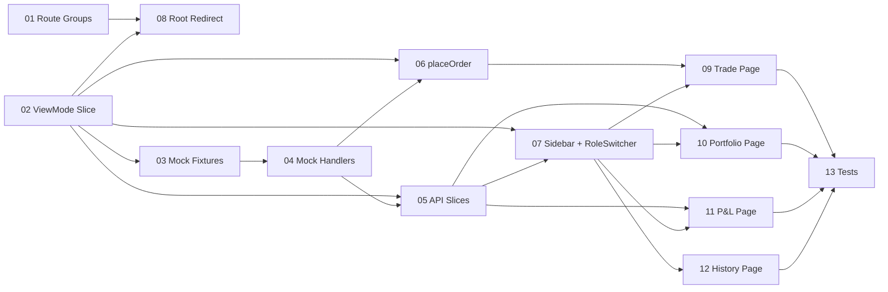

# Task Breakdown: User Dashboard

| Attribute | Value |
|-----------|-------|
| **HLD Reference** | [HLD-user-dashboard.md](../HLD-user-dashboard.md) |
| **Created** | 2026-08-04 |
| **Status** | Implemented |
| **Version** | 1.0 |

## Task Summary

| ID | Task | Domain | Dependencies | Status |
|----|------|--------|--------------|--------|
| 01 | Route group migration | Routing | - | completed |
| 02 | ViewMode types and Redux slice | State | - | completed |
| 03 | Mock fixtures (end-users, symbols, portfolio, P&L) | Mocks | 02 | completed |
| 04 | Extend mockBaseQuery with new handlers | Mocks | 03 | completed |
| 05 | New API slices (userApi, portfolioApi, pnlApi) + adapters | API | 02, 04 | completed |
| 06 | Extend ordersApi with placeOrder mutation | API | 02, 04 | completed |
| 07 | Sidebar refactor + RoleSwitcher component | UI/Layout | 02, 05 | completed |
| 08 | Root redirect (mode-aware) | Routing | 01, 02 | completed |
| 09 | Trade page + OrderForm components | UI/Trade | 06, 07 | completed |
| 10 | Portfolio page + HoldingsTable with live pricing | UI/Portfolio | 05, 07 | completed |
| 11 | P&L page + PnlSummary + PnlTable | UI/PnL | 05, 07 | completed |
| 12 | History page (reuses OrderTable) | UI/History | 07 | completed |
| 13 | Unit + component tests | Testing | 09, 10, 11, 12 | completed |

## Dependency Graph

## Task Files

- [task-01-route-groups.md](./task-01-route-groups.md)
- [task-02-viewmode-slice.md](./task-02-viewmode-slice.md)
- [task-03-mock-fixtures.md](./task-03-mock-fixtures.md)
- [task-04-mock-handlers.md](./task-04-mock-handlers.md)
- [task-05-api-slices.md](./task-05-api-slices.md)
- [task-06-place-order.md](./task-06-place-order.md)
- [task-07-sidebar-role-switcher.md](./task-07-sidebar-role-switcher.md)
- [task-08-root-redirect.md](./task-08-root-redirect.md)
- [task-09-trade-page.md](./task-09-trade-page.md)
- [task-10-portfolio-page.md](./task-10-portfolio-page.md)
- [task-11-pnl-page.md](./task-11-pnl-page.md)
- [task-12-history-page.md](./task-12-history-page.md)
- [task-13-tests.md](./task-13-tests.md)

---

## Implementation Report

> Filled after implementation by `/nb-feature-impl`

### Summary

Implemented the user dashboard end to end: mode-aware routing and navigation, end-user
context, mock fixtures and API handlers, defensive adapters, buy-order placement,
live-priced holdings, P&L reporting, order history, and regression coverage.

### Files Changed

| File | Action | Purpose |
|------|--------|---------|
| `app/(admin)`, `app/(user)` | Move/Create | Route-grouped admin and user pages |
| `components/layout`, `components/trade`, `components/portfolio`, `components/pnl` | Modify/Create | User dashboard UI |
| `lib/store`, `lib/api`, `lib/mocks`, `lib/trade`, `lib/types` | Modify/Create | State, data access, fixtures, utilities, and contracts |

### Tests Added

| Test | Coverage |
|------|----------|
| `viewModeSlice.test.ts` | Dashboard mode reducers |
| `tradeUtils.test.ts` | Validation and request construction |
| `userAdapters.test.ts` | Defensive user-dashboard response normalization |
| Existing suite | Admin dashboard regression coverage |

### Code Review Findings

Updated route-dependent test imports after the route-group migration and retained public URLs.
Added safe parsing for string decimals and bounded portfolio pricing to five symbols.

### Verification

- [x] All tests passing
- [x] Code compiles without errors
- [x] Matches architecture specification

---

## Revision History

| Date | Version | Changes |
|------|---------|---------|
| 2026-08-04 | 1.0 | Initial task breakdown |
